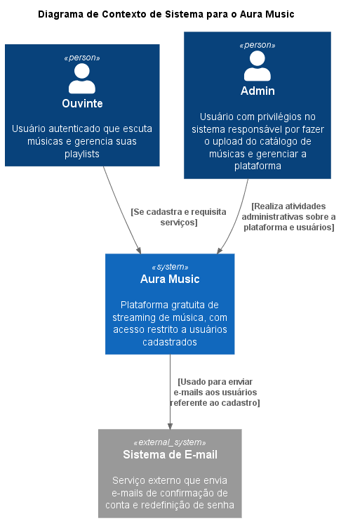
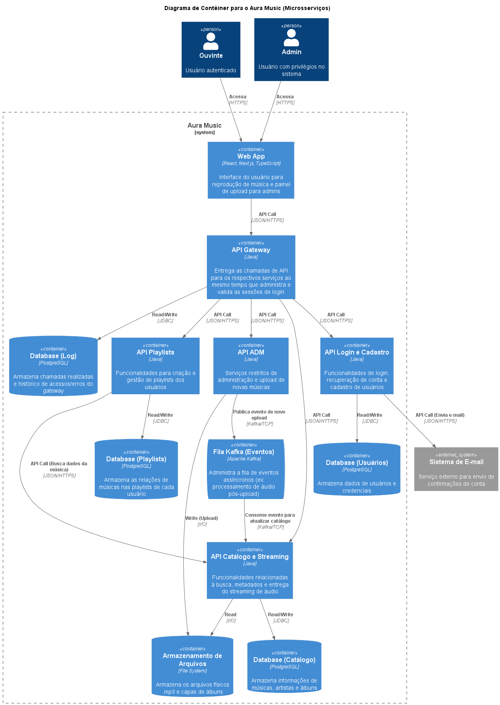
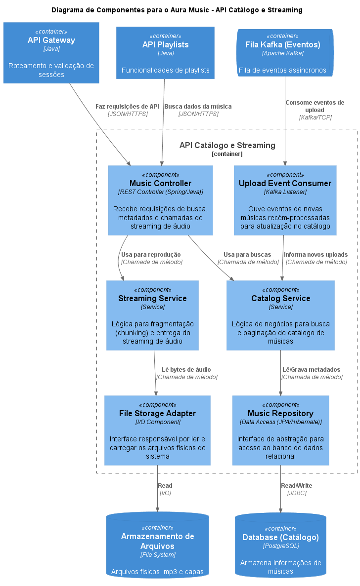
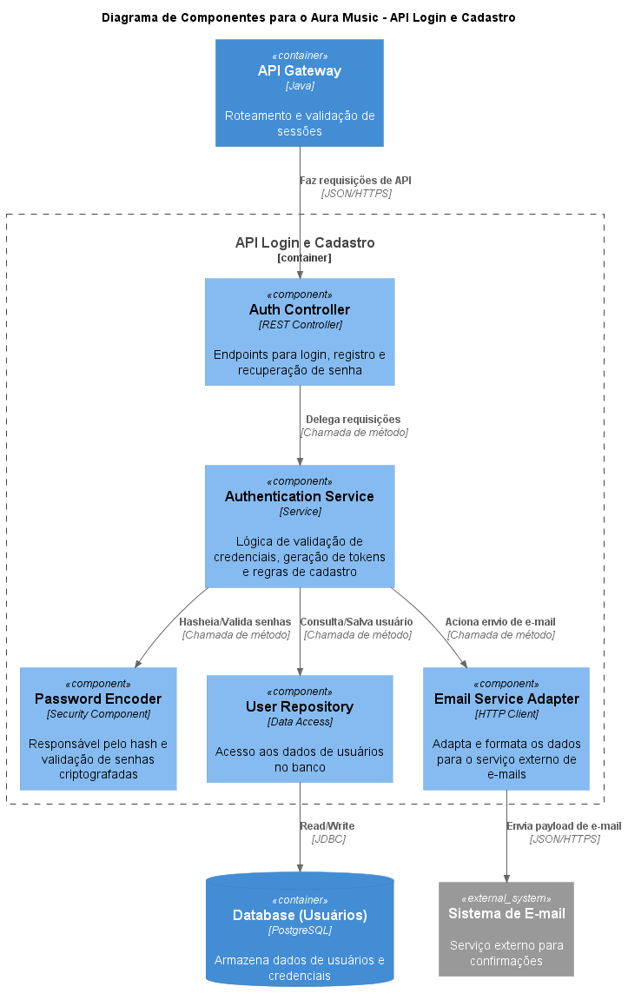
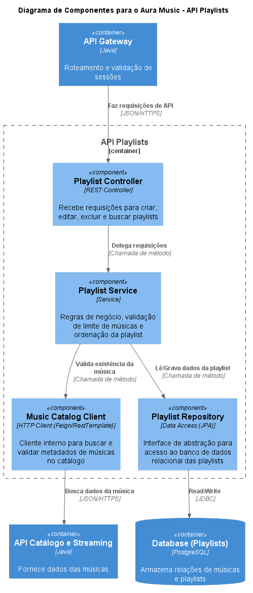
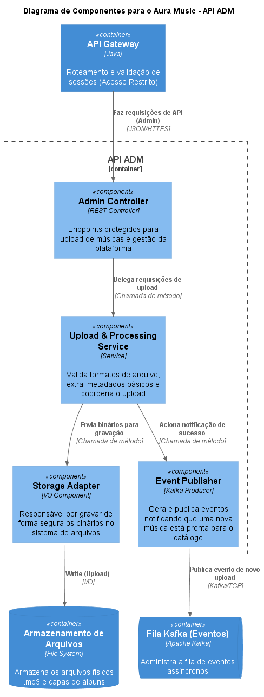

# 🎵 Aura Music

## Links Protótipo:
[Web](https://www.figma.com/proto/0dhsr7aXEIwemElDrDjzRn/Aura-Music?node-id=7-7&t=Awq4McOkmmOavw87-1&scaling=scale-down&content-scaling=fixed&page-id=0%3A1&starting-point-node-id=7%3A7&show-proto-sidebar=1)
|
[Mobile](https://www.figma.com/proto/0dhsr7aXEIwemElDrDjzRn/Aura-Music?node-id=34153-340&p=f&t=502gF1sHhZuRN09t-0&scaling=scale-down&content-scaling=fixed&page-id=34153%3A337&starting-point-node-id=34153%3A340)

## Metodologia: Abordagem Baseada em Projeto
Este projeto foi concebido como um desafio prático, com o objetivo de projetar, desenvolver e colocar em produção uma aplicação web funcional. A abordagem prioriza a resolução de um problema de domínio real, explorando tecnologias tanto no lado do cliente (frontend) quanto no lado do servidor (backend), além de aplicar boas práticas de engenharia de software e infraestrutura.

## Domínio do Problema
O sistema é uma plataforma web de streaming projetada para amantes de música. O objetivo principal é permitir que usuários descubram, ouçam e organizem suas faixas favoritas de maneira intuitiva, com uma experiência fluida de reprodução de áudio.

## Arquitetura e Padrões
O projeto adota uma arquitetura **Monolítica** modular no backend. Essa escolha simplifica o fluxo de CI/CD inicial e a infraestrutura, mas o código será estruturado de forma coesa (separado por domínios) para facilitar uma futura migração para **Microserviços**. 
Utilizaremos o padrão arquitetural **MVC** (Model-View-Controller) no design da API e aplicaremos Padrões de Projeto como **Repository** (para abstração de acesso a dados) e **Singleton** (no gerenciamento de injeção de dependências).

## Tecnologias e Justificativas
* **Frontend:** React | Next.js | Typescript | Tailwind CSS. 
  * *Justificativa:* Permite a criação de Single Page Applications (SPAs). Isso é vital para um player de música, garantindo que o usuário navegue pelo sistema sem que o áudio seja interrompido por recarregamentos de página.
* **Backend:** Java (Spring Boot). 
  * *Justificativa:* Framework robusto e padronizado para a criação de APIs REST, com excelente suporte integrado para segurança corporativa (Spring Security) e persistência de dados.
* **Banco de Dados:** PostgreSQL. 
  * *Justificativa:* Banco de dados relacional poderoso, ideal para garantir a consistência das transações de histórico de reprodução e para modelar relacionamentos complexos entre Usuários, Músicas e Playlists.
* **Repositório e DevOps:** GitLab. 
  * *Justificativa:* Oferece um ambiente centralizado para o código-fonte (Git) e possui ferramentas nativas poderosas para a construção de esteiras automatizadas de CI/CD.
* **Qualidade e Testes:** JUnit (Java) e Jest (React). 
  * *Justificativa:* Ferramentas consolidadas na indústria para suportar a prática de TDD com execução rápida e feedbacks precisos.
* **Observabilidade:** Spring Boot Actuator. 
  * *Justificativa:* Facilita a exposição de métricas de saúde (health checks) e telemetria da aplicação, essenciais para o monitoramento em ambiente de produção online.

## Engenharia e Produção (Deploy e CI/CD)
O repositório está configurado com um pipeline de Integração e Entrega Contínuas (CI/CD). A cada novo *push* na branch principal, o pipeline executa automaticamente os testes unitários. Se aprovados, ocorre o processo de *build* e o deploy é realizado automaticamente em um provedor de nuvem, deixando o sistema em ambiente de produção online de forma ágil e segura.

## Requisitos do Sistema

### Requisitos Funcionais (RF)

* **RF01 - Controles de Reprodução (Play/Pause/Skip)**
  * **Descrição:** Implementar as funções básicas de controle do fluxo de áudio para permitir a interação do usuário com a música.
  * **Critérios de Aceite:**
    * Alternar ícones de Play e Pause dinamicamente conforme o estado do áudio.
    * Botão "Next" deve carregar a próxima faixa da lista.
    * Botão "Prev" deve reiniciar a faixa atual ou voltar para a anterior.

* **RF02 - Barra de Progresso Interativa (Seek Bar)**
  * **Descrição:** Visualizar o tempo decorrido da música e permitir o salto para trechos específicos da timeline.
  * **Critérios de Aceite:**
    * Atualizar a barra em tempo real conforme o progresso do áudio.
    * Formatar tempo decorrido e total no padrão `mm:ss`.
    * Implementar funcionalidade de clique ou arraste para navegar na posição do áudio.

* **RF03 - Controle de Volume**
  * **Descrição:** Permitir que o usuário ajuste a intensidade sonora da aplicação ou silencie o áudio rapidamente.
  * **Critérios de Aceite:**
    * Implementar input range funcional para ajuste de volume (0 a 100).
    * Criar botão de Mute que preserva o estado do volume anterior ao ser desativado.
    * Exibir feedback visual no ícone de volume conforme o nível selecionado.

### Requisitos Não Funcionais (RNF)

* **RNF01 - Interface Responsiva (Mobile-First)**
  * **Descrição:** Garantir que os controles do player sejam acessíveis e o layout se ajuste corretamente a diferentes tamanhos de tela.
  * **Critérios de Aceite:**
    * Utilizar breakpoints do Tailwind CSS para adaptação de layout (Mobile/Desktop).
    * Garantir áreas de clique (touch targets) de no mínimo 44px para dispositivos móveis.
    * Otimizar o carregamento de imagens (capas dos álbuns) para conexões móveis.

* **RNF02 - Acessibilidade Web (a11y)**
  * **Descrição:** Tornar o player navegável via teclado e compatível com tecnologias assistivas para garantir inclusão.
  * **Critérios de Aceite:**
    * Adicionar `aria-label` em todos os botões que utilizam apenas ícones.
    * Suporte completo para navegação e acionamento via teclas `TAB` e `Espaço`.
    * Garantir contraste de cores adequado entre os textos e o fundo da aplicação.

## Arquitetura do Sistema (Modelo C4)

A arquitetura do Aura Music foi mapeada utilizando o modelo C4 para facilitar a compreensão do fluxo de dados e da comunicação entre os microsserviços.

### Nível 1: Contexto
Visão geral do sistema, mostrando os atores (Ouvinte e Admin) e as integrações externas.

### Nível 2: Contêineres
Visão arquitetural mostrando os microsserviços, o frontend, o API Gateway, bancos de dados e mensageria.

### Nível 3: Componentes
Detalhamento interno dos principais microsserviços do Aura Music:

**API Catálogo e Streaming:**

**API Login e Cadastro:**

**API Playlists:**

**API Admin:**

## Atribuições e Responsabilidades
- Protótipo e Front-end: [Lucas Moraes](https://github.com/hub-Moraes).
- Banco de Dados e Back-end: [Vitor Keller](https://github.com/vitorkeller).
